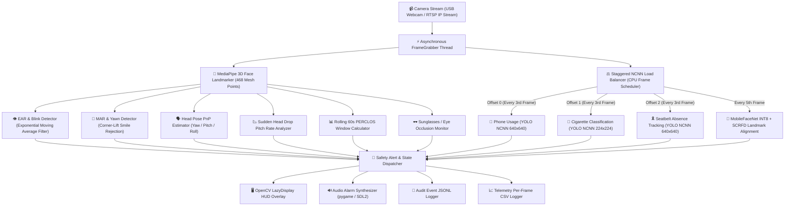

<div align="center">

# 🚘 **Driver Monitoring System (DMS)**

### 🚨 Real-Time Driver Drowsiness, Distraction, Safety Compliance & Biometric Verification Pipeline

A **production-grade AI surveillance pipeline** engineered for fleet cabins and industrial vehicle safety. Combines **MediaPipe 3D Face Landmarker + MobileFaceNet INT8 + YOLO NCNN Edge Models** for multi-signal fatigue monitoring, safety compliance, and real-time biometric driver identification.

> ⚙️ Powered by **MediaPipe 3D Mesh + YOLO NCNN + MobileFaceNet INT8**  
> 🧠 Engineered for **ultra-low latency, low false-positive rates & CPU load balancing**  
> 🧩 Part of the **CampNeuron AI Series** — engineered by the **Algosium AI Team**

---

[](#)
[](#)
[](#)
[](#)
[](#)
[](#)
[](#)

</div>

---

## 📖 Executive Summary

The **Driver Monitoring System (DMS)** is an edge-optimized computer vision engine designed for cabin surveillance in fleet management, transportation safety, and heavy machinery operations. Operating on live camera streams (USB webcams and RTSP IP cameras), the engine continuously analyzes:

- 👤 **Biometric Driver Identification**: Real-time face matching against registered employee embeddings.
- 👁️ **Fatigue & Drowsiness**: Eye Aspect Ratio (EAR), PERCLOS, blink visibility, and eye occlusion (e.g. IR sunglasses).
- 🥱 **Yawn & Mouth Activity**: Mouth Aspect Ratio (MAR) with smile/talk rejection.
- 🗣️ **Cognitive & Pose Distraction**: 3D head pose estimation (Yaw, Pitch, Roll) and look-away duration tracking.
- 📉 **Sudden Head Drop**: Nodding-off detection via pitch velocity rate analysis.
- 📱 **Unsafe Phone Usage**: YOLO NCNN 640x640 object detection with dual-tier confidence windows.
- 🚬 **Cigarette Smoking**: YOLO NCNN 224x224 face-crop classification (`cigarrete` vs `nocigarette`).
- 🎗️ **Seatbelt Compliance**: YOLO NCNN seatbelt detection with sustained absence tracking.
- 📷 **Camera Block & Health Monitoring**: Automatic lens occlusion, dark-frame, and blur detection.

---

## 🏗️ System Architecture Flowchart



---

## 🚀 Key Detection Signals & Technical Overview

The engine computes **10 concurrent safety signals** alongside biometric identity verification:

| Signal | Core Algorithm | Mathematical / Heuristic Method | Primary Config Parameter |
| :--- | :--- | :--- | :--- |
| 👤 **Driver Identification** | MobileFaceNet INT8 | Cosine distance of 112x112 aligned face embeddings against `employee_db.npz` | `DRIVER_ID_THRESHOLD = 0.50` |
| 👁️ **Drowsiness (EAR)** | MediaPipe FaceLandmarker | 6-point Eye Aspect Ratio with Exponential Moving Average (EMA) smoothing lag filter | `EAR_THRESHOLD = 0.25`, `EYES_CLOSED_HOLD_SEC = 0.67` |
| 🕶️ **Eye Occlusion** | Blink-Visibility Monitor | IR sunglasses & prolonged missing landmark detection | `NO_BLINK_TIMEOUT_SEC = 10.0` |
| 📊 **PERCLOS (Rolling)** | Temporal Buffer Tracker | Cumulative percentage of eye closure over a rolling 60-second window | `PERCLOS_ALERT_THRESHOLD = 0.40` |
| 🥱 **Yawning (MAR)** | Mouth Aspect Ratio | Inner-lip MAR ratio with corner-lift angle smile rejection | `MAR_THRESHOLD = 0.35`, `YAWN_HOLD_SEC = 0.5` |
| 🗣️ **Distraction (Gaze)** | PnP Pose Estimation | Head 3D rotation angles (Yaw, Pitch, Roll) relative to calibrated baseline | `YAW_ANGLE_MAX = 20.0°`, `PITCH_ANGLE_MAX = 20.0°` |
| 📉 **Head Drop** | Pitch Delta Rate | Sudden downward pitch velocity calculator (nodding off indicator) | `HEAD_DROP_DELTA = 0.12`, `PITCH_RATIO_DOWN = 0.62` |
| 📱 **Phone Usage** | YOLO NCNN Object Detector | 640x640 detection model with dual confidence windows (0.70 high / 0.45 calling position) | `PHONE_CONF_THRESHOLD = 0.70` |
| 🚬 **Cigarette Usage** | YOLO NCNN Classifier | 224x224 cropped face classifier (`cigarrete` vs `nocigarette`) | `CIGARETTE_CONF_THRESHOLD = 0.70` |
| 🎗️ **Seatbelt Compliance** | YOLO NCNN Detection | Inverted absence window tracking over sliding temporal buffer | `SEATBELT_ABSENT_WINDOW_SEC = 3.0` |
| 📷 **Camera Health** | Lens Block Monitor | Pixel variance, Laplacian blur, and brightness occlusion checks | `CAMERA_BLOCK_DARK_MEAN = 25.5` |

---

## 👤 Biometric Driver Identification (`face_identifier.py`)

The system features real-time driver identity verification:

- **Face Landmark Alignment**: Uses standard 5 2D landmarks (eyes, nose, mouth corners) via `uniface` SCRFD or MediaPipe mesh points to warp face crops to $112 \times 112$ pixels.
- **MobileFaceNet INT8 Embeddings**: Generates 128-dimensional L2-normalized embeddings using an INT8-quantized TFLite model.
- **Cosine Similarity Matching**: Matches live face embeddings against registered employee embeddings cached in `models/employee_db.npz`.
- **Real-Time Display**:
  - **Enrolled Employee** (Score $\ge 0.50$): Displays `Driver: <ID> - <Name> (<Score>)` in **GREEN**.
  - **Un-enrolled / Stranger** (Score $< 0.50$): Displays `Driver: UNKNOWN (<Score>)` in **RED** instantly.

### Employee Registration Directory Layout (`employee/`)
Place photo files inside `employee/` using standard naming syntax:
```text
employee/
├── 10281_John_Smith.jpg        # ID: 10281, Name: John Smith
├── 10282_Jane_Doe.png          # ID: 10282, Name: Jane Doe
├── 20000_vivek.jpg             # ID: 20000, Name: vivek
└── EMP03_Robert/               # Subfolder: photo collection
    ├── front.jpg
    └── left.jpg
```

During application startup, the system automatically builds and caches embeddings in `models/employee_db.npz`.

---

## 💻 System Requirements

### Hardware Requirements
- **CPU**: Intel Core i5 / AMD Ryzen 5 or ARM64 (Raspberry Pi 5 / Jetson Nano / Rockchip)
- **RAM**: Minimum 4 GB (8 GB recommended)
- **Video Input**: USB Webcam (720p / 1080p @ 30 FPS) or RTSP IP Camera stream

### Software Requirements
- **OS**: Linux (Ubuntu 20.04 / 22.04 LTS recommended) / macOS / Windows 11
- **Python**: 3.11 or 3.12 (managed via Conda environment `drowsinessVenv`)

---

## 🛠️ Installation & Setup

### Step 1: Conda Environment Setup (`drowsinessVenv`)

It is strongly recommended to use a **Conda** environment named `drowsinessVenv`:

```bash
# 1. Create Conda environment with Python 3.12
conda create -n drowsinessVenv python=3.12 -y

# 2. Activate environment
conda activate drowsinessVenv

# 3. Clone repository
git clone https://github.com/VishnuAlgosium/drowsiness_detection.git
cd drowsiness_detection

# 4. Install dependencies
pip install -r requirements.txt
```

---

## 📦 Model Assets Structure (`models/`)

Ensure model weights and NCNN artifacts are placed in `models/`:

```text
models/
├── face_landmarker.task                      # MediaPipe 3D Landmark Task Model
├── mobilefacenet_int8.tflite                 # MobileFaceNet INT8 Quantized Face Embedding Model
├── employee_db.npz                           # Pre-computed Employee Facial Embeddings Cache
├── phone_detection_v6_ncnn_model/           # NCNN Phone Object Detection Model
│   ├── model.ncnn.param
│   └── model.ncnn.bin
├── cigarette_classification_v1_ncnn_model/   # NCNN Cigarette Classifier Model
│   ├── model.ncnn.param
│   └── model.ncnn.bin
└── seatbelt_detection_v1_ncnn_model/        # NCNN Seatbelt Compliance Detection Model
    ├── model.ncnn.param
    └── model.ncnn.bin
```

### Downloading MediaPipe Task Asset
```bash
wget -O models/face_landmarker.task \
  https://storage.googleapis.com/mediapipe-models/face_landmarker/face_landmarker/float16/1/face_landmarker.task
```

---

## 🎮 Running the Application

### 1. Local Execution (Conda)
```bash
conda activate drowsinessVenv
python main.py
```

### 2. Startup Cache Prompt
If `models/employee_db.npz` already exists:
```text
[INFO] Employee folder changed since the cache was built -- rebuilding
```
If unchanged, it loads directly from `models/employee_db.npz` in less than 0.1 seconds.

### 3. Interactive Hotkeys
> Note: OpenCV window must have active system focus.
- **`v`**: Toggle display HUD rendering ON / OFF (dramatically lowers CPU usage for headless deployments).
- **`q`**: Safely shutdown video streams, stop grabber threads, and release audio devices.

---

## 🐳 Docker Container Deployment

The repository includes a production-grade multi-stage `Dockerfile` and `docker-compose.yml`.

### Quickstart with Docker Compose
```bash
# Build and launch container in background
docker compose up --build -d

# View real-time container logs
docker compose logs -f

# Stop container
docker compose down
```

### Manual Docker Build & Run
```bash
# Allow X11 local display access (Linux GUI HUD)
xhost +local:root

# Build Docker image
docker build -t drowsiness-detection:latest .

# Run container with webcam & PulseAudio
docker run --rm -it \
  --device /dev/video0:/dev/video0 \
  -e DISPLAY=$DISPLAY \
  -v /tmp/.X11-unix:/tmp/.X11-unix \
  -v ./employee:/app/employee \
  -v ./logs:/app/logs \
  drowsiness-detection:latest
```

---

## ⚙️ Configuration Parameters (`src/config.py`)

All system thresholds, frame offsets, and feature toggles are centralized in `src/config.py`:

| Category | Constant | Default Value | Description |
| :--- | :--- | :--- | :--- |
| **Drowsiness** | `EAR_THRESHOLD` | `0.25` | Base Eye Aspect Ratio threshold |
| | `EYES_CLOSED_HOLD_SEC` | `0.67s` | Sustained eye closure duration before drowsiness alert |
| | `EAR_SMOOTHING_TAU_SEC` | `0.065s` | Time-constant for Exponential Moving Average (EMA) filtering |
| **Yawn** | `MAR_THRESHOLD` | `0.35` | Mouth Aspect Ratio open threshold |
| | `YAWN_HOLD_SEC` | `0.5s` | Continuous mouth opening hold time |
| | `CORNER_LIFT_MAX` | `8.0°` | Maximum corner-lift angle to reject smiles/laughter |
| **Distraction** | `YAW_ANGLE_MAX` | `20.0°` | Max allowed head yaw angle deviation |
| | `PITCH_ANGLE_MAX` | `20.0°` | Max allowed head pitch angle deviation |
| | `DISTRACTION_HOLD_SEC` | `0.5s` | Sustained look-away duration before distraction alert |
| **Head Drop** | `HEAD_DROP_DELTA` | `0.12` | Minimum pitch velocity rise rate for nodding off |
| | `PITCH_RATIO_DOWN` | `0.62` | Downward pitch ratio cutoff |
| **Phone** | `PHONE_CONF_THRESHOLD` | `0.70` | YOLO confidence threshold for phone detection |
| | `PHONE_DETECT_EVERY_N_FRAMES` | `3` | Staggered frame inference interval |
| **Cigarette** | `CIGARETTE_CONF_THRESHOLD` | `0.70` | YOLO classification confidence threshold |
| **Seatbelt** | `SEATBELT_ABSENT_WINDOW_SEC` | `3.0s` | Absence observation window |
| **Biometrics** | `DRIVER_ID_THRESHOLD` | `0.50` | Cosine similarity threshold for `KNOWN` match |
| | `FACE_RECOGNITION_EVERY_N_FRAMES` | `5` | Frame interval for real-time face identification |

---

## 📊 Telemetry & Audit Logs (`logs/`)

The engine generates dual telemetry streams:

### 1. JSONL Audit Log (`logs/<camera_id>_<date>.jsonl`)
Records discrete safety violation events for audit trails and cloud syncing:
```json
{
  "timestamp": "2026-10-07T14:30:15.124Z",
  "event": "drowsiness_detected",
  "driver_id": "20000",
  "driver_name": "vivek",
  "metrics": {
    "ear": 0.175,
    "smoothed_ear": 0.182,
    "ear_threshold": 0.245,
    "eyes_closed_sec": 0.72,
    "yaw_deg": 3.2,
    "pitch_deg": 1.4
  }
}
```

### 2. Frame Telemetry CSV (`logs/frames_<timestamp>.csv`)
Per-frame sensor logging for offline analytics and model evaluation:
```text
frame_num,face_found,current_ear,current_mar,phone_conf,cigarette_conf,seatbelt_conf,current_perclos,yaw,pitch,roll,fps,driver_id
```

---

## 🧪 Model Verification & Testing Utilities

Verify NCNN model conversion outputs against PyTorch `.pt` weights:
```bash
conda activate drowsinessVenv
python compare.py \
    --images-dir ./test_images \
    --pt-model ./models/cigarette_classification_v1.pt \
    --ncnn-model ./models/cigarette_classification_v1_ncnn_model \
    --face-model ./models/face_landmarker.task \
    --padding 0.3
```

---

## 📁 Repository Directory Structure

```text
drowsiness_detection/
├── main.py                  # Primary application entry point
├── compare.py               # NCNN export vs PyTorch comparison utility
├── Dockerfile               # Production multi-stage Docker build file
├── docker-compose.yml       # Docker Compose multi-container deployment
├── DOCKER_README.md         # Full Docker deployment & operational guide
├── requirements.txt         # Dependencies list
├── employee/                # Driver enrollment dataset (portrait images)
├── models/                  # NCNN weights, TFLite models & MediaPipe task assets
├── logs/                    # Automated JSONL alert logs & CSV telemetry outputs
└── src/
    ├── config.py            # Global thresholds, offsets & environment flags
    ├── detector.py          # Central detection coordinator & pipeline controller
    ├── face_identifier.py   # MobileFaceNet INT8 & SCRFD / MediaPipe face recognition
    ├── driver_identity.py   # Driver identity tracking & baseline profile persistence
    ├── capture.py           # Multi-threaded background FrameGrabber
    ├── ear.py               # Eye Aspect Ratio (EAR) calculator
    ├── mar.py               # Mouth Aspect Ratio (MAR) calculator
    ├── gaze.py              # 3D Head Pose (Yaw/Pitch/Roll) estimation
    ├── perclos.py           # Rolling PERCLOS temporal window manager
    ├── blink_visibility.py  # Sunglasses & blink visibility monitor
    ├── camera_health.py     # Lens occlusion, blur & dark frame monitor
    ├── phone.py             # Phone usage detection handler
    ├── cigarette.py         # Cigarette smoking classification handler
    ├── seatbelt.py          # Seatbelt compliance detection handler
    ├── audio.py             # Pygame SDL2 audio alert synthesizer
    └── display.py           # OpenCV HUD annotation & bounding box renderer
```

---

<div align="center">

**Engineered with ❤️ by the Algosium AI Team**

</div>