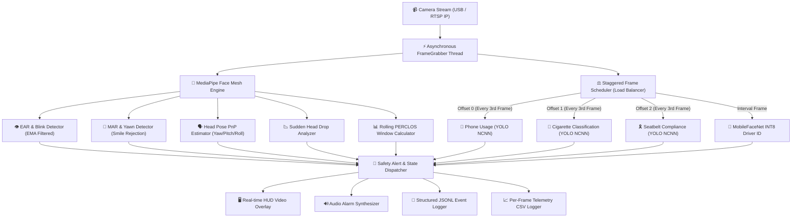

<div align="center">

# 🚘 **Driver Monitoring System (DMS)**

### 🚨 Real-Time Driver Drowsiness, Distraction & Identity Verification Pipeline

A **production-grade AI monitoring pipeline** built for real-time video stream & webcam surveillance. Combines **MediaPipe Face Mesh + MobileFaceNet INT8 + YOLO NCNN Edge Models** for multi-signal driver safety and biometric identification with ultra-low latency.

> ⚙️ Powered by **MediaPipe + YOLO NCNN + MobileFaceNet INT8**  
> 🧠 Engineered for **low false-positive rates & balanced CPU load**  
> 🧩 Part of the **CampNeuron AI Series** — engineered by the **Algosium AI Team**

---

[](#)
[](#)
[](#)
[](#)
[](#)
[](#)

</div>

---

## 📖 Executive Summary

The **Driver Monitoring System (DMS)** is an enterprise-ready vision pipeline designed for cabin surveillance in fleet management, transportation safety, and industrial operations. Operating on live camera feeds (USB Webcams, RTSP IP Cameras), the engine evaluates driver fatigue, cognitive distraction, safety violations, and biometric identity in real time.

By utilizing a **shared feature-extraction backbone** and **staggered NCNN model scheduling**, the system achieves 30+ FPS real-time processing on standard edge CPUs without requiring heavy GPU hardware.

---

## 🏗️ System Architecture Flowchart



---

## 🚀 Key Features & Detection Signals

The engine runs **9 simultaneous safety algorithms** alongside biometric driver identity verification:

| Signal | Detection Algorithm | Mathematical / Heuristic Basis | Key Configuration Parameter |
| :--- | :--- | :--- | :--- |
| 👤 **Driver Identification** | MobileFaceNet INT8 | Cosine distance of 112x112 aligned face embeddings | `FACE_RECOGNITION_ENABLED` |
| 👁️ **Drowsiness (EAR)** | MediaPipe FaceLandmarker | 6-point Eye Aspect Ratio with Exponential Moving Average | `EAR_THRESHOLD`, `CONSEC_FRAMES` |
| 🕶️ **Eye Occlusion** | Blink-Visibility Monitor | IR sunglasses detection via prolonged missing eye landmarks | `NO_BLINK_TIMEOUT_SEC` |
| 📊 **PERCLOS (Rolling)** | Temporal Buffer Tracker | Cumulative percentage of eye closure over sliding window | `PERCLOS_ALERT_THRESHOLD` |
| 🥱 **Yawning (MAR)** | Mouth Aspect Ratio | Inner-lip MAR ratio with corner-lift smile rejection | `MAR_THRESHOLD`, `YAWN_HOLD_SEC` |
| 🗣️ **Distraction (Gaze)** | PnP Pose Estimation | Head 3D rotation angles (Yaw, Pitch, Roll) vs baseline | `YAW_ANGLE_MAX`, `PITCH_ANGLE_MAX` |
| 📉 **Head Drop** | Pitch Delta Rate | Rapid downward pitch velocity (nodding off indicator) | `HEAD_DROP_DELTA`, `PITCH_RATIO_DOWN` |
| 📱 **Phone Usage** | YOLO NCNN Object Detection | 640x640 detection model with multi-frame confirmation | `PHONE_CONF_THRESHOLD` |
| 🚬 **Cigarette Usage** | YOLO NCNN Classifier | 224x224 cropped face classifier (`cigarette` vs `nocigarette`) | `CIGARETTE_CONF_THRESHOLD` |
| 🎗️ **Seatbelt Absence** | YOLO NCNN Detection | Inverted absence window tracking over temporal buffer | `SEATBELT_ABSENT_FRAMES` |

---

## 🧠 Core Engineering & Performance Principles

> [!NOTE]
> Designed specifically for CPU-bound edge devices, achieving low-latency operation through zero-copy processing and compute distribution.

- **Single-Pass Landmark Extraction**: MediaPipe 468 3D landmarks are computed once per frame and reused across 7 separate detection modules.
- **Staggered NCNN Execution**: High-cost deep learning inferences are distributed across consecutive frames (`Offset 0: Phone`, `Offset 1: Cigarette`, `Offset 2: Seatbelt`) to prevent framerate micro-stutters.
- **Asynchronous Frame Ingestion**: Threaded `FrameGrabber` handles webcam/RTSP stream buffers in the background to ensure latency does not accumulate over time.
- **Pre-computed Biometric Caching**: MobileFaceNet embeddings are automatically calculated and cached in `models/employee_db.npz` upon first indexing.

---

## 💻 System Requirements

### Hardware Specifications
- **Processor**: Intel Core i5 / AMD Ryzen 5 or ARM64 (Raspberry Pi 5 / Jetson Nano)
- **RAM**: Minimum 4 GB (8 GB recommended)
- **Camera**: USB Webcam (720p/1080p @ 30 FPS) or RTSP IP Stream (H.264/H.265)

### Software Platform
- **Operating System**: Linux (Ubuntu 20.04/22.04 LTS recommended) / macOS / Windows 11
- **Python Runtime**: Python 3.11 or 3.12 via **Conda**

---

## 🛠️ Environment Setup & Installation

### Step 1: Conda Environment Setup (`drowsinessVenv`)

We strongly recommend creating an isolated **Conda** environment named `drowsinessVenv`.

```bash
# 1. Create the conda environment with Python 3.12
conda create -n drowsinessVenv python=3.12 -y

# 2. Activate the environment
conda activate drowsinessVenv

# 3. Clone repository and navigate to project root
git clone https://github.com/VishnuAlgosium/drowsiness_detection.git
cd drowsiness_detection

# 4. Install dependencies
pip install -r requirements.txt
```

---

## 📦 Model Assets Setup

Ensure all NCNN model folders and Google MediaPipe tasks are present in `models/`:

```text
models/
├── face_landmarker.task                      # MediaPipe 3D Landmark Model
├── mobilefacenet_int8.tflite                 # INT8 Quantized Face Embedding Model
├── phone_detection_v6_ncnn_model/           # NCNN Phone Detection Artifacts
│   ├── model.ncnn.param
│   └── model.ncnn.bin
├── cigarette_classification_v1_ncnn_model/   # NCNN Cigarette Classification Artifacts
│   ├── model.ncnn.param
│   └── model.ncnn.bin
└── seatbelt_detection_v1_ncnn_model/        # NCNN Seatbelt Detection Artifacts
    ├── model.ncnn.param
    └── model.ncnn.bin
```

### Download MediaPipe Task Model
```bash
wget -O models/face_landmarker.task \
  https://storage.googleapis.com/mediapipe-models/face_landmarker/face_landmarker/float16/1/face_landmarker.task
```

---

## 👤 Employee Dataset & Face Registration

To enable automated driver identification, place clear driver portrait photos into the `employee/` folder following the standard naming syntax (`<ID>_<Name>.jpg` or `<ID>.jpg`):

```text
employee/
├── EMP001_John_Doe.jpg
├── EMP002_Jane_Smith.jpg
└── EMP003_Robert_Chen.png
```

During startup, the system crops, aligns (112x112), and indexes facial embeddings into `models/employee_db.npz`.

---

## 🎮 Running the Application

Ensure `drowsinessVenv` is activated prior to execution:

```bash
conda activate drowsinessVenv
python main.py
```

### Startup Database Prompt
If `models/employee_db.npz` is detected, you will be prompted:
```text
[QUESTION] Found cached employee database. Do you want to update/rebuild from 'employee' folder? (y/N):
```
- Press **`y`** to re-scan `employee/` and update facial embeddings.
- Press **`Enter`** (or wait 3 seconds) to load directly from cache.

### Runtime Hotkeys
> Note: OpenCV Video Window must have active OS window focus.

- **`v`**: Toggle display HUD rendering ON / OFF (optimizes headless CPU usage).
- **`q`**: Safely shutdown streams, release audio devices, and write log footers.

---

## ⚙️ Configuration Reference (`src/config.py`)

All tuning parameters are centralized in `src/config.py` to prevent hardcoded magic numbers:

| Category | Constant | Default | Description |
| :--- | :--- | :--- | :--- |
| **Drowsiness** | `EAR_THRESHOLD` | `0.25` | Baseline Eye Aspect Ratio cutoff threshold |
| | `CONSEC_FRAMES` | `20` | Closed-eye frame persistence required for alert |
| | `EAR_THRESHOLD_RATIO` | `0.75` | Calibration ratio applied to personalized baseline |
| **Yawn** | `MAR_THRESHOLD` | `0.35` | Mouth Aspect Ratio cutoff threshold |
| | `YAWN_HOLD_SEC` | `0.5s` | Continuous mouth opening duration |
| | `CORNER_LIFT_MAX` | `8.0°` | Max corner-lift angle to reject smiles |
| **Gaze** | `YAW_ANGLE_MAX` | `20.0°` | Maximum allowed head yaw angle deviation |
| | `PITCH_ANGLE_MAX` | `20.0°` | Maximum allowed head pitch angle deviation |
| **Phone** | `PHONE_CONF_THRESHOLD` | `0.70` | YOLO confidence threshold for phone detection |
| | `PHONE_DETECT_EVERY_N_FRAMES` | `3` | Frame interval for phone inference execution |
| **Cigarette** | `CIGARETTE_CONF_THRESHOLD` | `0.70` | YOLO classification confidence threshold |
| **Seatbelt** | `SEATBELT_ABSENT_FRAMES` | `24 / 30` | Absence frames required within 30-frame window |
| **Logging** | `LOG_RETENTION_DAYS` | `14` | Days to keep CSV / JSONL audit logs |

---

## 📊 Telemetry & Audit Logging Schemas

The engine generates dual telemetry channels inside the `logs/` directory:

### 1. JSONL Audit Log (`logs/<camera_id>_<date>.jsonl`)
Structured alert event records for security compliance and audit trails.

```json
{
  "timestamp": "2026-10-06T11:30:15.124Z",
  "event": "DROWSINESS_ALERT",
  "driver_id": "EMP001_John_Doe",
  "metrics": {
    "ear": 0.18,
    "perclos": 0.42,
    "fps": 31.4
  }
}
```

### 2. Per-Frame Metrics CSV (`logs/frames_<timestamp>.csv`)
Telemetry recorded frame-by-frame for offline analysis and QA model tuning:

```text
timestamp,frame_num,fps,driver_id,ear,mar,perclos,yaw,pitch,roll,phone_conf,cigarette_conf,seatbelt_present
```

---

## 🧪 Advanced Utilities: Model Verification

To verify NCNN conversion accuracy against PyTorch source weights:

```bash
conda activate drowsinessVenv
python compare.py \
    --images-dir ./test_images \
    --pt-model ./models/cigarette_classification_v1.pt \
    --ncnn-model ./models/cigarette_classification_v1_ncnn_model \
    --face-model ./models/face_landmarker.task \
    --padding 0.3
```

---

## 📁 Repository Directory Structure

```text
drowsiness_detection/
├── main.py                  # Entry point script
├── compare.py               # NCNN vs PyTorch model verification tool
├── requirements.txt         # Package dependencies
├── employee/                # Driver enrollment dataset (facial photos)
├── models/                  # NCNN weights & MediaPipe model artifacts
├── logs/                    # Automated JSONL & CSV telemetry output directory
└── src/
    ├── config.py            # Global thresholds, parameters & feature flags
    ├── detector.py          # Core processing engine & detection coordinator
    ├── face_identifier.py   # MobileFaceNet INT8 alignment & matching
    ├── capture.py           # Multi-threaded background FrameGrabber
    ├── ear.py               # Eye Aspect Ratio (EAR) calculator
    ├── mar.py               # Mouth Aspect Ratio (MAR) calculator
    ├── gaze.py              # Head pose (Yaw/Pitch/Roll) estimation
    ├── perclos.py           # Sliding temporal PERCLOS buffer manager
    ├── blink_visibility.py  # Occlusion & blink detector
    ├── phone.py             # Phone usage detection handler
    ├── cigarette.py         # Cigarette usage classification handler
    ├── seatbelt.py          # Seatbelt compliance detection handler
    ├── audio.py             # Audio alert playback manager
    └── display.py           # OpenCV HUD annotation renderer
```

---

<div align="center">

**Engineered with ❤️ by the Algosium AI Team**

</div>